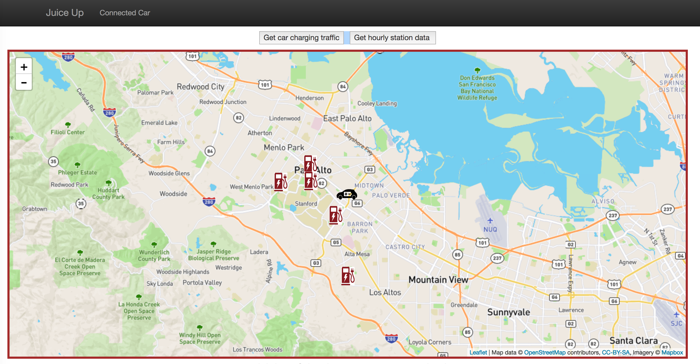

# Juice Up - Don't wait just charge 

Do you own an EV car? That's great for the environment but how is the car charging coming along.
Have you waited in line to charge your car at the stations. Here is a solution that gives you real time availability of charging stations near you. The good part is that you don't have to figure it out , your smart car will do it for you.

We are looking at a tremendous growth in the connected cars technology in the coming years. Cars currently send out data about their location, ignition, charge level, speed ,etc. This project's focus is on charging your car with minimum wait time at the charging stations using real time data from a network on charging stations and location data from connected cars.

http://insightjuiceup.com/trip

Look up available charging stations in real time.

Also, check for connected car traffic in the vicinity of the charging station in real time.

# Technology stack

Data source : NREL API to fetch data for charging stations across the US

Fields ingested:
Timestamp 
Charging Station Name
City
State
Zipcode
Longitude
Latitude
Status code
Connector types
Total charging outlets

Streaming pipeline:

The Data stream was ingested using Kafka topics. The data was filtered using Spark streaming and indexed into Elastic searh to serve geo location based queries.

!()

Batch data:

To collect historical data the streaming data was collected in batches using Spark and written into S3 as a source of truth.
Batch data was partitioned by stations and time ordering and written to Cassandra to plot charts for statistics on hourly usage of charging stations.

Technology used : 

Ingestion :
Apache Kafka

Streaming :
Spark streaming

Batch : 
Spark

Data store :
Elastic search
Cassandra

AWS Cluster configuration - 

Spark and Kafka cluster - 1 Master and 3 Worker nodes m3.medium

Elasticsearch - 3 node cluster m3.medium

Flask : 1 node m3.medium

Cassandra : 3 nodes m3.medium

